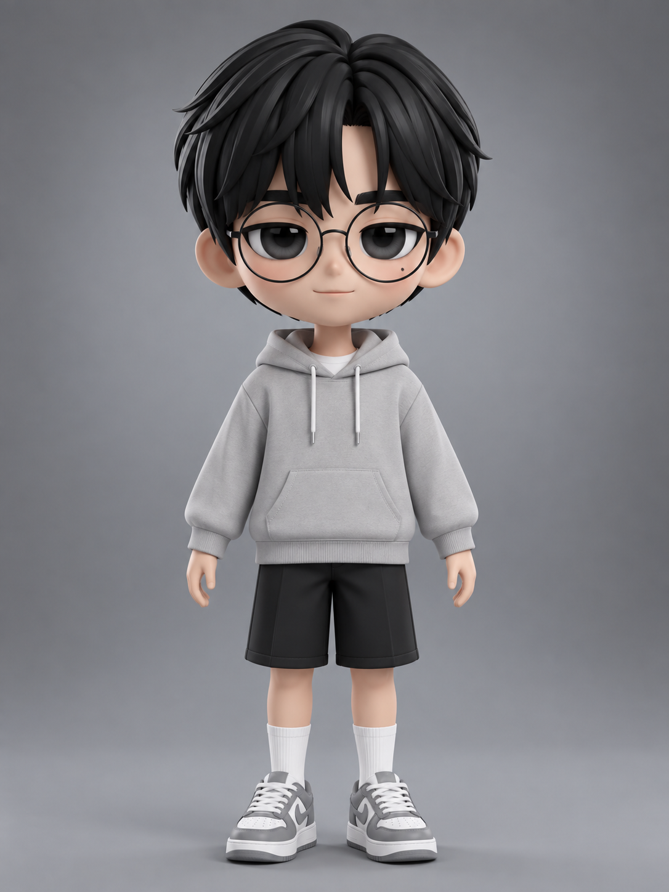
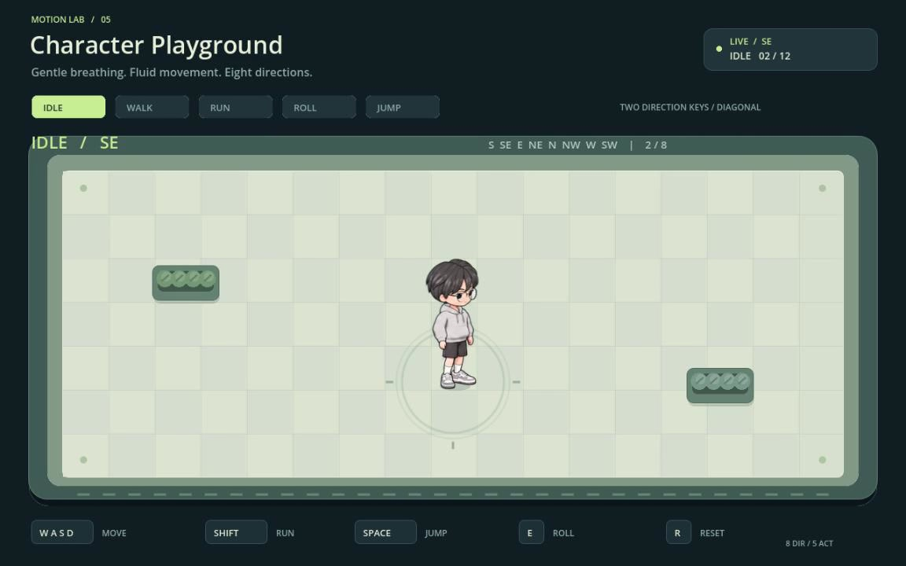
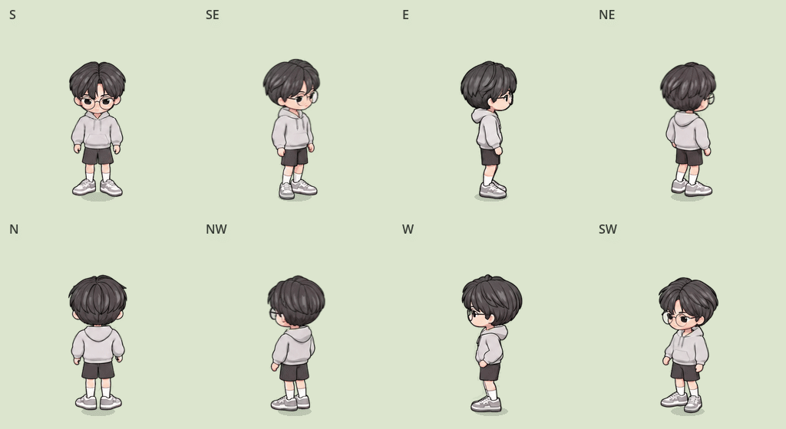
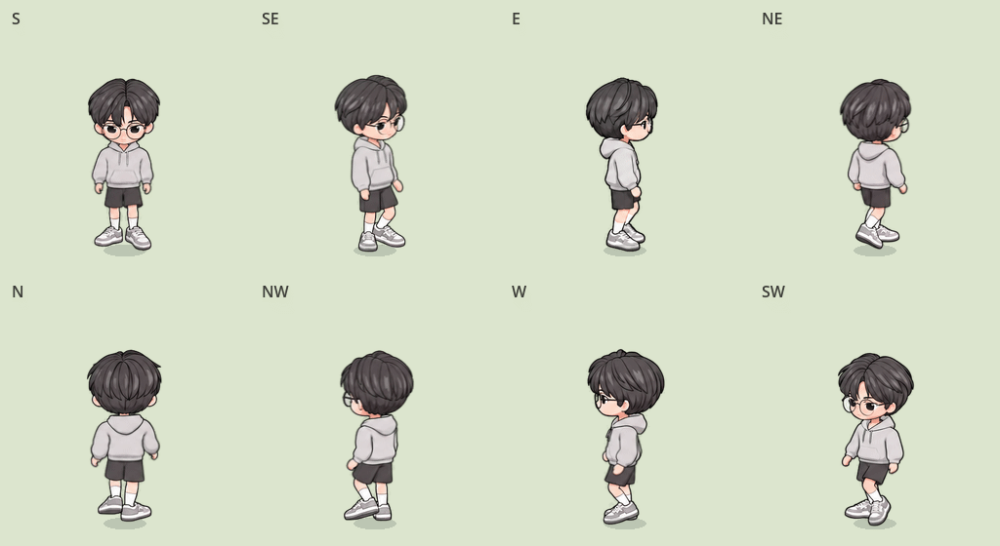
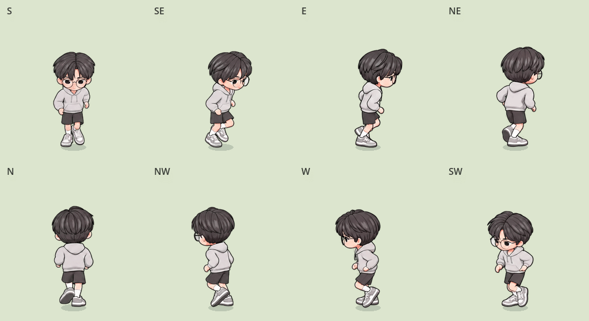
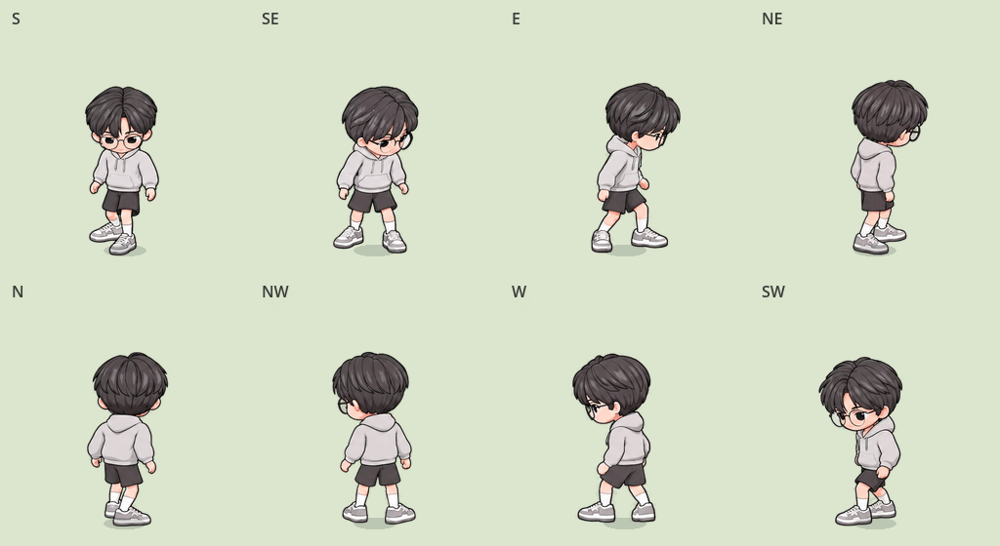
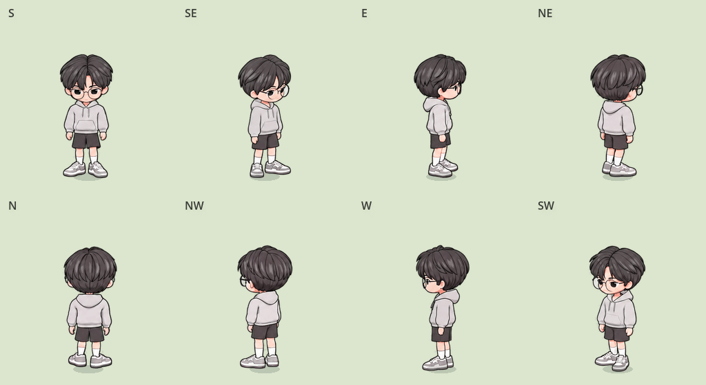
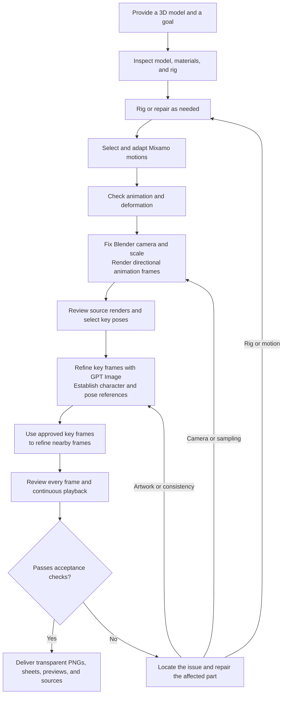

# codex-to-2d-sprites

**English** | [简体中文](README.md)

License: [MIT](LICENSE)

**Give Codex a 3D character model and let it handle rigging and motion adaptation, multi-direction rendering, GPT Image refinement, and quality review to produce animation assets for a 2D game.**

Supports 4 or 8 directions and actions such as idle, walk, run, roll, and jump. You provide the model and the goal; Codex chooses parameters, writes the necessary scripts, uses available tools, and fixes issues it finds.

This is a workflow skill for Codex. It requires access to Blender, image generation/editing tools, and an animation source. The repository does not include those applications, accounts, or character models.

## Case study: from a GPT image to a controllable Godot character

**[Open the showcase: watch the video, switch animations, and view the original image →](https://zhangrlll.github.io/codex-to-2d-sprites/en.html)**

The complete process for this character was: **Generate a character image with GPT → use that image in Tripo AI to create a 3D model → give the model to this skill → produce multi-direction animation assets → control the character in Godot.**

Image creation and Tripo AI modeling are preparation steps before using the skill. The skill starts with a supplied 3D model and handles rig inspection and repair, Mixamo motion adaptation, Blender rendering, GPT Image refinement, verification, and revision. When an engine demo is requested, it continues with Godot integration and checks playback and action transitions in the actual scene.

### Original GPT image

<a href="docs/media/gpt-character-original.png"></a>

[View or download the unmodified original PNG](docs/media/gpt-character-original.png). This user-supplied character design was the visual source for the subsequent Tripo AI model.

### Godot scene recording

[](https://zhangrlll.github.io/codex-to-2d-sprites/en.html#video)

**[Watch the full recording online](https://zhangrlll.github.io/codex-to-2d-sprites/en.html#video)** · [MP4 file](docs/media/godot-eight-directions.mp4)

The recording runs for approximately **1 minute 45 seconds at 30 FPS**. It shows idle, walk, run, roll, and jump in eight directions—40 combinations—followed by four transitions from walking/running into a roll/jump. A script sends input actions to the existing character controller, and Godot Movie Maker captures the real scene. The character's position is reset between labeled takes.

| Time | Recording chapter |
| --- | --- |
| 00:01 | Eight-direction idle with subtle breathing |
| 00:32 | Eight-direction walk |
| 00:46 | Eight-direction run |
| 00:56 | Eight-direction roll |
| 01:16 | Eight-direction jump |
| 01:34 | Walk/run into roll/jump, then resume movement |

Godot controls: `WASD` to move, combined direction keys for diagonals, `Shift` to run, `Space` to jump, `E` to roll, and `R` to reset. The showcase displays a recording; character input is handled in the Godot scene.

### Eight-direction animation GIFs

These GIFs use **the final Godot sprite rendering**, including runtime corrections for head stability and idle breathing. The first row is **S, SE, E, NE**; the second is **N, NW, W, SW**.

**Idle**



| Walk | Run |
| --- | --- |
|  |  |
| Roll | Jump |
|  |  |

GIFs have a background for viewing; production assets use transparent PNGs and sprite sheets. The roll/jump GIFs show the complete actions. See the video for the shortened transitions used during movement. Character models, downloaded Mixamo files, and the complete game project are not included in this skill repository.

[Recording scripts and instructions](examples/recording/README.en.md) · [Coverage and media verification for all 40 combinations](examples/recording/verification.json)

## 1. The skill workflow



### ① Receive the 3D model, inspect it, and prepare the rig

Provide the character model and textures, the desired actions and direction count, and an optional art style.

Codex inspects the mesh, materials, orientation, scale, bone hierarchy, skin weights, and attachment relationships. It tests deformation with poses such as raised arms, bent knees, and torso twists. A usable rig is reused; a missing or unsuitable rig is added, repaired, or retargeted on a copy of the model.

Glasses, eyes, headwear, and other attachments must follow the correct bones. Review includes both static data and deformation during actual motion. The original model is retained for recovery.

### ② Select and adapt Mixamo animations

Reuse suitable animations already available for the character first. For missing actions, search Mixamo for candidates and choose based on the model's proportions and actual playback.

For example, check for excessive stride length on a short-legged character or head penetration into the ground when a large-headed character rolls. Adaptation compares bone hierarchy, rest pose, axes, and scale, as well as bone names.

After importing motion, check foot sliding, twisted joints, collapsed arms, intersections, takeoff and landing, and loop boundaries. Repair and review as needed, then save editable model sources with animations that can be selected and played.

### ③ Render directional animation frames in Blender

Use a fixed orthographic camera, viewing angle, lighting, world scale, and shared pivot. Render each direction by rotating the character or moving the camera around it equivalently.

| Direction count | Output row order |
| --- | --- |
| 4 | S, E, N, W |
| 8 | S, SE, E, NE, N, NW, W, SW |

S faces the viewer, E faces screen-right, N faces away, and W faces screen-left. The diagonals are front-right, back-right, back-left, and front-left. Verify the model's front and rotation direction before rendering. Do not substitute mirrored images for missing views.

Sample according to the action's timing and retain each frame's source and duration. Separate horizontal root movement for walking/running as appropriate to the intended use; retain the vertical height of a jump. All frames share a canvas and pivot to prevent jitter caused by individual automatic cropping. Do not scale crouching or rolling poses to standing height.

These Blender renders provide the pose reference for subsequent image refinement.

### ④ Refine key frames with GPT Image

Choose representative poses for each direction and action phase, such as:

- Walk/run: foot contact, passing poses, and airborne phases.
- Jump: anticipation, takeoff, apex, and landing.
- Roll: dive, inversion, support, and recovery.

Here, “key frames” means representative poses used to establish appearance and style. The user does not have to mark them manually in advance.

Codex uses the available GPT Image/ImageGen editing tool. The corresponding 3D render constrains the pose, while the user's reference or an established character master constrains identity and style. Check head proportions, face, hairstyle, clothing, attachments, orientation, and limbs before expanding production.

### ⑤ Use approved key frames to refine nearby frames

Once key frames pass review, process the remaining nearby frames by action segment:

- **The current frame's 3D render** determines its pose, position, and occlusion.
- **Nearby approved key frames** provide local appearance and drawing references.
- **The character master** maintains identity and proportions across the complete set.

Edit individual frames or small groups according to complexity and check the boundaries between groups. Add suitable key-pose references for head turns, inverted poses, or complicated occlusion.

Every requested final frame must receive the 2D treatment. Do not mix a few refined key frames with untreated 3D renders or copy key-frame poses to replace the real motion in neighboring frames.

### ⑥ Verify, revise, and verify again

Final review combines visual inspection, continuous playback, and file validation.

| Review method | What to check |
| --- | --- |
| Individual frames | Pose and direction, malformed limbs, missing attachments, intersections, clipping, head proportions, color shifts, and size jitter. |
| Continuous playback | Timing, foot contact, neighboring-frame continuity, loop boundaries, segment transitions, and unintended pauses. |
| File validation | Complete action/direction/frame counts, readable files, correct alpha, consistent canvas and pivot, and correct mapping from atlas cells to individual frames. |
| Delivery validation | Correct timing and loop flags, source files that reopen and play, complete textures, and a valid ZIP. |

When an issue appears, trace it to rigging, motion, rendering, or drawing and rework the affected part. A checkerboard-looking background does not prove transparency: inspect the actual alpha channel. If direct generation cannot produce real transparency, use a solid background and then remove it, align frames, and assemble sheets when tool rules and user authorization allow. The key color must not conflict with the character's colors.

Keep review records. Change methods when repeated repairs do not help, and identify the specific missing dependency when work cannot continue. Image generation can vary; passing review does not guarantee absolute pixel consistency. Report remaining differences such as hair strands or clothing folds accurately.

### ⑦ Deliver the final assets

Typical deliverables include:

- Individual transparent PNG frames for each action and direction.
- A sprite sheet per action, plus a combined atlas when texture limits allow.
- A manifest with frame order, directions, durations, loop flags, pivots, and atlas coordinates.
- GIFs or an HTML preview with action/direction selection, pause, frame stepping, and speed controls.
- Editable model sources with rig, animations, and textures.
- Actual generation prompts, review results, usage instructions, and a ZIP asset package.

For example, 5 actions × 8 directions × 12 frames per direction produces 480 individual frames. The output canvas size and the actual illustration resolution generated by GPT Image are recorded separately.

## 2. How to use the skill

### Requirements

| Requirement | Purpose |
| --- | --- |
| Codex | Access to the model's working directory and the ability to run local tools. |
| Blender | Model inspection, rig/motion processing, and multi-direction rendering. |
| Image generation and editing | The Codex environment must expose a callable GPT Image/ImageGen tool. Installing this skill does not enable that capability by itself. |
| Animation source | Existing animation files can be used. Mixamo requires an accessible browser and account. |
| Python or other local runtimes | Used as needed for image inspection, background removal, alignment, frame extraction, and atlas assembly. Codex handles the scripts and parameters. |
| Character model and textures | A Blender-importable model, such as FBX, GLB/GLTF, or `.blend`, with its associated textures. |

Usually, you only need the model, textures, and a short goal. Existing animations and style references can reduce repeated work. Login, CAPTCHA, permission, or download obstacles may require limited help from you; the other stages proceed according to the workflow.

### Installation

The skill is located at `skills/codex-to-2d-sprites/` in this repository.

**Option 1: Ask Codex to install it.** Send:

```text
Use $skill-installer to install the skill at
skills/codex-to-2d-sprites from the GitHub repository
zhangrlll/codex-to-2d-sprites.
```

**Option 2: Install manually.** Download or clone the repository and copy the entire `skills/codex-to-2d-sprites` folder into either location:

- Personal use: `~/.agents/skills/codex-to-2d-sprites/`. On Windows: `%USERPROFILE%\.agents\skills\codex-to-2d-sprites\`.
- One project only: `<project>/.agents/skills/codex-to-2d-sprites/`.

The installed folder must directly contain `SKILL.md`, along with `references/` and `agents/`. Codex detects skills; if it does not appear, restart and check again. See the [official OpenAI Skills documentation](https://learn.chatgpt.com/docs/build-skills) for installation locations and activation.

### Minimal request

Open the project folder containing the model in Codex, attach the model or provide an accessible path, and send:

```text
Use $codex-to-2d-sprites.

Create idle, walk, run, roll, and jump animations in 8 directions
from this 3D model. Preserve the character's appearance and produce
transparent animation assets in a clean 2D style.

Inspect and repair the rig, find and adapt suitable motions, and
render the frames in Blender. Refine the key frames first, then
use them as references to refine the nearby frames.
Review every frame and continuous playback. Fix issues and check again.

Deliver transparent PNGs, action sheets, previews, editable sources,
and a review report. Choose the remaining parameters yourself.
```

### Specify a model, frame count, and style

Replace the example paths below with your actual file locations. `outputs/` is relative to the current project.

```text
Use $codex-to-2d-sprites.

Model: D:\MyCharacter\character.glb
Style reference: D:\MyCharacter\style.png
Actions: idle, walk, run, roll, jump
Directions: 8
Frames per action per direction: 12
Output canvas: 512 × 512
Output directory: outputs/

Preserve the hairstyle, glasses, clothing, and body proportions.
If direct generation does not produce a genuinely transparent background,
you may use a solid color that does not conflict with the character,
then use scripts to remove the background, align, split, and assemble frames.

Do not require me to prepare configurations or scripts beforehand.
Complete the workflow and report the review results and any remaining
visual differences when you deliver the assets.
```

You can request a subset of actions or change the direction count to 4. When unspecified, the skill defaults to 4 directions, a 512-pixel canvas, approximately 12 key poses per direction, and a clean 2D style that preserves the character's identity. Fast or complex motion may need additional samples based on continuity review.

### Continue an existing task or repair an issue

```text
Use $codex-to-2d-sprites to continue production in this project.

Read the existing production records first. Reuse approved models,
animations, and assets. Check the changing head size when running right
and the pause after landing from a jump.
Only repair the affected parts, then review again and update the
asset package and review records.
```

### Add a playable Godot scene

You can append this to your request:

```text
After the assets pass review, integrate them into a Godot scene.
Use WASD for eight-direction walking, Shift to run, Space to jump,
and E to roll. Check idle breathing, head stability, and transitions
from walking/running into rolls and jumps.
Use this animation's contact frames to distinguish stationary and
moving action clips. Prevent standing anticipation and recovery poses
from sliding with the character. Verify playback in the actual engine.
```

A Godot scene is an additional task and requires Godot in the environment. The skill's base scope is a 3D model to multi-direction 2D assets. Engine controllers, clip trimming, head stabilization, and breathing must be implemented and verified for the current assets. Runtime shader effects are not automatically baked into the original PNGs.

### Repository layout

```text
codex-to-2d-sprites/
├── README.md                    # Chinese
├── README.en.md                 # English
├── LICENSE                      # MIT license
├── .gitignore
├── docs/
│   ├── index.html               # Chinese showcase
│   ├── en.html                  # English showcase
│   ├── site.css
│   ├── site.js
│   └── media/                   # Original art, GIFs, and recording
├── examples/
│   └── recording/               # Capture scripts and verification
└── skills/
    └── codex-to-2d-sprites/
        ├── SKILL.md
        ├── LICENSE              # Retained with standalone skill installs
        ├── agents/
        │   └── openai.yaml
        └── references/
            ├── blender-mixamo.md
            └── imagegen-delivery.md
```

`SKILL.md` defines the execution stages and quality gates. The two reference files cover Blender/Mixamo and GPT Image/asset delivery. Each character's models, downloaded motions, production records, and generated results belong in its task project. Codex generates working parameters for that task.

## 3. License

This project is licensed under the [MIT License](LICENSE), with the notice `Copyright (c) 2026 zhangrlll`. The license covers this repository's skill, scripts, documentation, website, and example media to the extent the project author has the right to license them.

Use, modification, distribution, and commercial use are permitted. Copies or substantial portions must retain the copyright and license notices. The project is provided as is, without warranty; the complete license text governs.

Third-party tools, services, models, and animation resources remain subject to their own terms. This license does not grant third-party rights the project author cannot license. Keep the included `LICENSE` when installing or distributing the skill separately.
