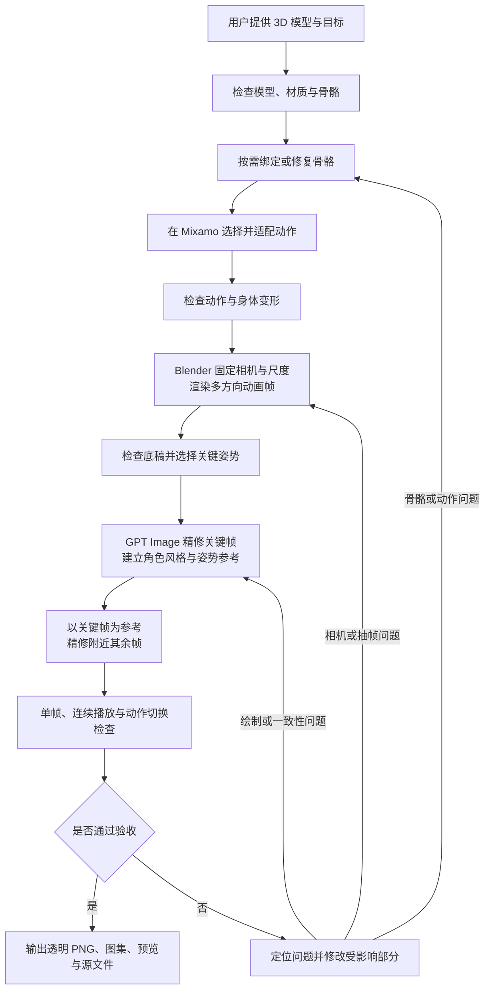

# codex-to-2d-sprites

**简体中文** | [English](README.md)

协议：[MIT](LICENSE)

**给 Codex 一个 3D 角色模型，让它完成骨骼与动作适配、多方向抽帧、GPT Image 精修和质量复检，生成可用于 2D 游戏的动画素材。**

支持 4 或 8 个方向，可指定待机、行走、奔跑、翻滚、跳跃等动作。用户负责提供模型与目标，Codex 自行选择参数、编写所需脚本、调用可用工具并处理发现的问题。

这是一个供 Codex 执行的工作流 skill。运行时需要能够使用 Blender、图像生成／编辑工具，以及所需的动作来源；仓库本身不附带这些软件、账号或角色模型。

## 实际案例：从一张 GPT 原图，到可操作的 Godot 角色

**[打开完整展示页：播放录像、切换动图、查看原图 →](https://zhangrlll.github.io/codex-to-2d-sprites/zh-CN.html)**

本案例的完整链路是：**GPT 生成角色原图 → 使用原图在 Tripo AI 生成 3D 模型 → 将模型交给本 Skill → 制作多方向动画素材 → 在 Godot 中操控角色。**

原图与 Tripo AI 建模是进入 Skill 前的准备阶段。本 Skill 从用户提供的 3D 模型开始，完成骨骼检查与修复、Mixamo 动作适配、Blender 抽帧、GPT Image 精修、校验和重新修改；需要引擎演示时，继续集成 Godot 并检查真实播放与动作衔接。

### GPT 生成的原图

<a href="docs/media/gpt-character-original.png"></a>

[查看／下载未修改的原始 PNG](docs/media/gpt-character-original.png)。这是用户提供的角色设计原图，也是后续 Tripo AI 模型的外观来源。

### Godot 场景录像

[](https://zhangrlll.github.io/codex-to-2d-sprites/zh-CN.html#video)

**[在线观看完整录像](https://zhangrlll.github.io/codex-to-2d-sprites/zh-CN.html#video)** · [MP4 文件](docs/media/godot-eight-directions.mp4)

录像约 **1 分 45 秒，30 FPS**，依次展示八个方向的 idle、walk、run、roll、jump，共 40 组，并追加走／跑接翻滚、跳跃的四种衔接。录制方式是用脚本发送按键驱动原有角色控制器，由 Godot Movie Maker 捕获实际场景画面；各个带标题的片段之间重置角色位置。

| 时间 | 录像内容 |
| --- | --- |
| 00:01 | 八方向 Idle 待机与轻微呼吸 |
| 00:32 | 八方向 Walk 行走 |
| 00:46 | 八方向 Run 奔跑 |
| 00:56 | 八方向 Roll 翻滚 |
| 01:16 | 八方向 Jump 跳跃 |
| 01:34 | 走／跑接翻滚、跳跃，再恢复移动 |

Godot 场景操作：`WASD` 移动，组合方向键控制斜向，`Shift` 奔跑，`Space` 跳跃，`E` 翻滚，`R` 重置。本页提供的是录像展示，实际操作发生在 Godot 场景中。

### 八方向动画动图

以下 GIF 来自**当前最终版本的 Godot 精灵渲染**，包含头部稳定和待机呼吸的运行时修正。第一行是 **S、SE、E、NE**，第二行是 **N、NW、W、SW**。

**Idle · 待机**


| Walk · 行走 | Run · 奔跑 |
| --- | --- |
|  |  |
| Roll · 翻滚 | Jump · 跳跃 |
|  |  |

GIF 带背景，便于观看；正式素材交付使用透明 PNG 和图集。翻滚／跳跃 GIF 展示完整动作，移动中的精简衔接请看录像。模型、Mixamo 下载文件和完整游戏工程不包含在这个 Skill 仓库中。

[录制脚本与制作方法](examples/recording/README.zh-CN.md) · [40 组动作覆盖与媒体检查记录](examples/recording/verification.json)

## 1. 整个 Skill 的工作流程



### ① 接收 3D 模型，检查并绑定骨骼

用户提供角色模型和配套贴图，说明希望制作哪些动作、多少方向，以及可选的美术风格。

Codex 检查网格、材质、模型朝向、尺寸、骨架层级、蒙皮权重及附件关系，并用抬臂、屈膝、扭身等姿势验证角色是否能正常变形。已经可用的骨架会被复用；缺少骨骼或绑定不适合时，在模型副本上进行绑定、修复或重定向。

眼镜、眼睛、头饰等部件需要跟随正确骨骼。检查既看静态数据，也看实际动作中的变形。原始模型保留，方便回退。

### ② 在 Mixamo 中选择并适配动作

优先复用本角色已有的可用动作；缺少动作时，在 Mixamo 搜索候选动作，并结合模型比例和实际播放结果选择。

例如，短腿角色要检查步幅是否过大，大头角色要检查翻滚时头部是否穿地。动作适配会核对骨架层级、静止姿态、轴向和比例，不仅比较骨骼名称。

动作导入后检查脚滑、关节扭曲、手臂塌陷、穿模、起跳与落地，以及循环首尾的连接。必要时修复后复查，保存可切换和播放各动作的模型源文件。

### ③ 在 Blender 中拍摄多方向动画帧

使用固定的正交相机、拍摄角度、灯光、世界比例和公共锚点，通过旋转角色或等价的相机环绕，真实渲染各个方向。

| 方向数量 | 输出行序 |
| --- | --- |
| 4 方向 | S、E、N、W |
| 8 方向 | S、SE、E、NE、N、NW、W、SW |

S 为正面，E 朝屏幕右，N 为背面，W 朝屏幕左。斜方向分别为右前、右后、左后和左前。拍摄前先验证模型正面和旋转方向，不用镜像代替缺失视角。

根据动作节奏采样，保留每帧来源和持续时间。走跑需要按用途分离整体水平位移；跳跃的腾空高度保留。所有帧共用画布与锚点，避免逐帧自动裁切造成位置跳动，也不把下蹲和翻滚强行缩放成站立高度。

这些 Blender 渲染帧作为后续精修的姿势底稿。

### ④ 使用 GPT Image 精修关键帧

从各方向、各动作阶段选择有代表性的关键姿势，例如：

- 行走／奔跑：脚底接触、身体经过、腾空等姿势。
- 跳跃：准备、起跳、最高点和落地。
- 翻滚：扑身、倒置、支撑和起身。

这里的“关键帧”指用于确定画面和风格的代表姿势，不要求用户提前手工标记。

Codex 调用当前可用的 GPT Image／ImageGen 编辑能力，以对应 3D 帧约束姿势，以用户参考图或建立的角色母版约束身份与风格。先检查关键帧的头部比例、脸、发型、服装、附件、朝向和四肢，再扩大生产。

### ⑤ 以关键帧为参考，精修附近的其他帧

关键帧通过检查后，按动作区段处理附近的其余帧：

- **当前帧的 3D 底稿**决定这一帧的姿势、位置和遮挡。
- **附近已通过的关键帧**提供局部外观与画法参考。
- **角色风格母版**保持整套素材的身份与比例一致。

根据动作复杂度采用单帧或小组编辑，检查相邻小组的连接。出现转头、倒置或复杂遮挡时，增加合适的关键姿势参考。

最终要求的每一帧都要完成 2D 风格化。不能只精修几张关键帧，就将其余未经处理的 3D 渲染混入成品；也不能复制关键帧姿势来代替附近的真实动作。

### ⑥ 校验、修改，再校验

视觉验收固定采用 **单帧、连续播放、动作切换** 三种检查方式，覆盖用户要求的全部动作和 4／8 个方向。文件齐全、接触表好看，或一个方向的 GIF 正常，都不能代替完整验收。

| 检查项目 | 重点 |
| --- | --- |
| 角色外观一致性 | 跨动作和帧间的发色、肤色、服装颜色统一；发型、袖条、鞋袜及附件不突然改变。 |
| 头身比例 | 头部大小、脸型、四肢粗细稳定；结合对应 3D 姿势区分透视变化与生成变形。 |
| 朝向与透视 | 头身朝向合理，转向时不突然换脸或改变发型结构。 |
| 动作与肢体结构 | 手脚无错位、缺失和非预期穿插，肘膝弯曲自然，翻滚连贯。 |
| 位置与地面接触 | 站立脚底不漂移，走跑不明显滑步，翻滚不穿地，跳跃有明确腾空与落地。 |
| 逐帧稳定性 | 头发、轮廓、五官和衣服细节不闪烁、抖动或突然膨胀收缩。 |
| 节奏与循环接缝 | 动作节奏、预备与缓冲合理，末帧接首帧没有跳变。 |
| 动作切换 | idle ↔ walk ↔ run，以及跳跃、翻滚前后，外观、比例和位置不突变。 |
| 透明边缘与游戏内表现 | 黑、白、实际场景背景下无绿边和杂点，正常显示尺寸下清晰且方向易辨。 |

检查按以下顺序执行：

1. **对照与单帧**：建立所有动作共用的角色外观基准；把同方向 idle、walk、run 的可比代表帧并排，先检查发色和头身比例，再与对应 3D 底稿比较。加入翻滚／跳跃的关键阶段，并逐一查看全部最终帧。对照图保持相同显示比例，不把各张头部裁片缩成一样大来掩盖问题。
2. **连续播放**：全部动作 × 方向按真实时序、正常游戏尺寸播放，循环动作至少连续三轮；再慢速和逐帧定位问题，检查邻帧、动作极值、接触帧和循环首尾。
3. **切换与交互**：覆盖全部请求方向的启停、变向、走跑切换，以及从 idle／walk／run 进入跳跃或翻滚，再回到待机或继续移动；在不同步态阶段触发，并测试动作中松开方向键。Godot 可用时复用当前场景或建立最小验收场景，用输入驱动实际控制器检查。

仅做素材任务时无需额外交付完整游戏。Godot 不可用时先用预览检查切换边界，引擎交互明确记为“未验证”；任务若要求 Godot 场景，该部分仍未完成。没有实际场景背景时说明临时背景的替代范围，之后补验。

发现问题后回到对应的绑定、动作、渲染或绘制阶段修复，复检受影响帧、邻帧、循环、同方向其他动作及相关切换。统一头框尺寸、冻结所有动作的头部或长时间淡化切换，不是通用修复方法。**交付 PNG／图集与 Godot 最终画面分别验收**，运行时 Shader 不能掩盖源素材缺陷。

文件验证另行检查动作／方向／帧数、真实 alpha、公共画布与锚点、图集对应关系、时序、源文件和 ZIP 完整性。图片看起来像棋盘背景不代表透明。无法直接得到真透明时，可按工具规则及用户授权使用纯色背景，再去底、对齐和拼图；底色需要避开角色本身的颜色。

保留跨动作对照板、动作 × 方向覆盖、切换的进入／返回状态与触发阶段，以及问题帧、修复前后和复检证据。报告区分“通过／未通过／未验证／不适用”，对应最终交付版本。明显发色跳变、头部膨胀或切换突变不能标为通过；轻微差异如实说明。重复修复无效时换方法，无法继续时说明具体缺口。

完整执行标准见 [动画视觉验收流程](skills/codex-to-2d-sprites/references/visual-qa.md)。

### ⑦ 得到最终素材

通常交付：

- 每个动作、每个方向的独立透明 PNG 帧。
- 动作 Sprite Sheet，以及适合纹理尺寸时的多动作总图集。
- 包含帧顺序、方向、持续时间、循环属性、锚点和图集坐标的清单。
- GIF 或可切换动作／方向、暂停、逐帧和调速的 HTML 预览。
- 带骨骼、动作和贴图的可编辑模型源文件。
- 实际生成提示词、检查结果、使用说明和 ZIP 素材包。

例如，5 个动作 × 8 个方向 × 每方向 12 帧，会输出 480 张独立帧。输出画布尺寸与 GPT Image 实际生成的插画分辨率会分别记录。

## 2. 整个 Skill 的用法

### 使用前准备

| 需要的内容 | 说明 |
| --- | --- |
| Codex | 能读取模型所在的工作目录，并执行本地工具。 |
| Blender | 用于模型检查、骨骼／动作处理和多方向渲染。 |
| 图像生成与编辑能力 | 当前 Codex 环境需提供可调用的 GPT Image／ImageGen 工具。安装 skill 本身不会自动开通该能力。 |
| 动作来源 | 可使用已有动作文件；使用 Mixamo 时需具备可访问的浏览器和账号。 |
| Python 等本地运行环境 | 按需用于图片检查、去底、对齐、切帧和图集组装；具体脚本和参数由 Codex 处理。 |
| 角色模型与贴图 | 可以提供 Blender 可导入的模型，例如 FBX、GLB／GLTF 或 `.blend`；同时提供关联贴图。 |

通常只需要准备模型、配套贴图以及一句目标描述。已有动作、风格参考图都可以提供，能减少重复工作。登录、验证码、权限或下载障碍可能需要用户提供最小帮助，其余阶段按工作流自行推进。

### 安装

本仓库中的 skill 位于 `skills/codex-to-2d-sprites/`。

**方法一：通过 Codex 安装。** 将下面的指令发送给 Codex：

```text
使用 $skill-installer，从 GitHub 仓库
zhangrlll/codex-to-2d-sprites
安装 skills/codex-to-2d-sprites 目录中的 skill。
```

**方法二：手动安装。** 下载或克隆仓库，将整个 `skills/codex-to-2d-sprites` 文件夹复制到以下任一位置：

- 个人使用：`~/.agents/skills/codex-to-2d-sprites/`。Windows 对应 `%USERPROFILE%\.agents\skills\codex-to-2d-sprites\`。
- 仅用于某个项目：`<项目目录>/.agents/skills/codex-to-2d-sprites/`。

确认安装后的文件夹内直接包含 `SKILL.md`，并带有 `references/` 和 `agents/`。Codex 会检测 skill；未显示时可重启后再检查。安装位置与触发机制参考 [OpenAI 官方 Skills 文档](https://learn.chatgpt.com/docs/build-skills)。

### 最简调用

在 Codex 中打开存放模型的项目文件夹，附上模型或填写可访问的路径，然后发送：

```text
使用 $codex-to-2d-sprites。

用这个 3D 模型制作 8 方向的 idle、walk、run、翻滚和跳跃，
保持角色外观，生成简洁 2D 风格的透明动画素材。

自行检查和修复骨骼、寻找并适配动作、在 Blender 中抽帧，
先精修关键帧，再以关键帧为参考处理附近的其他帧。
对照同方向各动作的发色与头身比例，完成单帧、连续播放、
动作切换三种检查，覆盖全部八方向，发现问题后修改并复查。

最终交付透明 PNG、动作图集、预览、源文件和检查报告。
其余参数由你判断并执行。
```

### 指定模型、帧数和风格

下面路径是示例，使用时替换为实际文件位置。`outputs/` 为相对当前项目的输出目录。

```text
使用 $codex-to-2d-sprites。

模型：D:\MyCharacter\character.glb
风格参考：D:\MyCharacter\style.png
动作：idle、walk、run、roll、jump
方向：8
每个动作每个方向：12 帧
输出画布：512 × 512
输出目录：outputs/

保持发型、眼镜、服装和身体比例。
如果直接生成的背景不是真透明，允许使用与角色颜色不冲突的
纯色背景，并用脚本去底、对齐、切帧和拼接。

无需我预先写配置或脚本。请完成全部流程，
交付时说明检查结果及仍存在的外观差异。
```

可以只指定某些动作，或者将方向改为 4。未指定时，skill 默认采用 4 方向、512 像素画布、每方向约 12 个关键姿势，以及保留角色身份的简洁 2D 风格。快速或复杂动作会根据连贯性判断是否需要更多采样。

### 继续已有任务或修复问题

```text
使用 $codex-to-2d-sprites，继续当前项目的制作。

先读取已有生产记录，复用已经通过检查的模型、动作和素材。
先对照不同动作的发色，检查同一动作中的头部大小变化，
再按视觉验收流程检查单帧、连续播放和动作切换，覆盖全部请求方向。
分别检查原始 PNG 和引擎画面，不能仅靠 Shader 掩盖素材问题。
只修改受影响的部分，复检相关邻帧、循环和切换，
更新素材包，并提交覆盖记录、修复对照和未通过／未验证项。
```

### 如需 Godot 可玩场景

可以在任务中追加：

```text
素材通过检查后，再接入 Godot 场景。
WASD 控制八方向行走，Shift 奔跑，Space 跳跃，E 翻滚。
检查待机呼吸、头部稳定，以及走跑与翻滚／跳跃的衔接。
根据这次动作的接触帧区分原地和移动触发片段，
避免站立准备和收尾姿势随角色滑行，最后在引擎中实际播放验证。
```

Godot 场景属于追加任务，需要当前环境具备 Godot。这个 skill 的基本交付范围是模型到多方向 2D 素材；引擎控制器、动作裁剪、头部稳定和呼吸处理需要针对本次素材实施与验证。运行时 Shader 效果也不会自动烘焙到原始 PNG 中。

### 仓库结构

```text
codex-to-2d-sprites/
├── README.md                    # 英文说明（默认）
├── README.zh-CN.md              # 中文说明
├── README.en.md                 # 保留原英文链接
├── LICENSE                      # MIT 协议
├── .gitignore
├── docs/
│   ├── index.html               # 英文展示页（默认）
│   ├── zh-CN.html               # 中文展示页
│   ├── en.html                  # 保留原英文链接
│   ├── site.css
│   ├── site.js
│   └── media/                   # 原图、动图和录像
├── examples/
│   └── recording/               # 录制脚本与检查记录
└── skills/
    └── codex-to-2d-sprites/
        ├── SKILL.md
        ├── LICENSE              # 单独安装 Skill 时保留协议
        ├── agents/
        │   └── openai.yaml
        └── references/
            ├── blender-mixamo.md
            ├── imagegen-delivery.md
            └── visual-qa.md
```

`SKILL.md` 定义执行步骤和质量门槛；三个参考文件分别处理 Blender／Mixamo、GPT Image／素材交付和动画视觉验收。每个角色的模型、下载动作、生产记录和生成结果放在任务项目中，工作参数由 Codex 按任务生成。

## 3. 开源协议

本项目采用 [MIT 协议](LICENSE)，版权声明为 `Copyright (c) 2026 zhangrlll`。授权范围包括本仓库的 Skill、脚本、文档、网页以及项目作者有权许可的示例媒体。

允许使用、修改、分发和商用；分发副本或实质性部分时须保留版权声明与许可文本。项目按现状提供，不作担保，具体以完整协议为准。

第三方工具、服务、模型及动作资源仍适用其原有条款，本协议不授予项目作者无权许可的第三方权利。单独安装或分发 Skill 时，请保留其目录中的 `LICENSE`。
